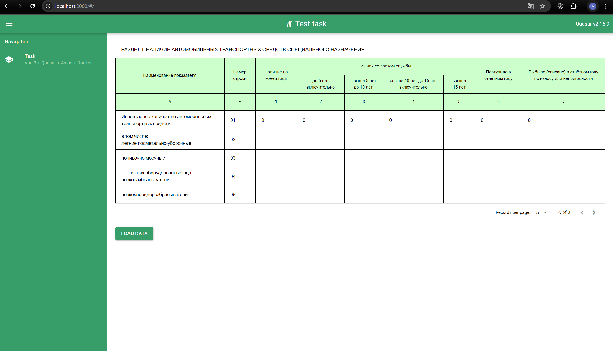
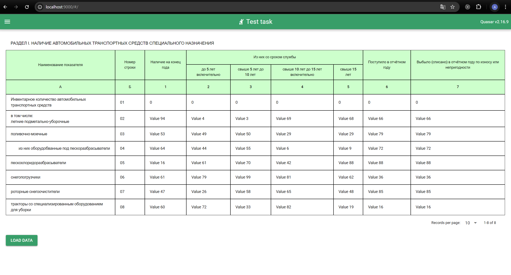

# Tesk Task

---

## Tech Stack

- Vue
- Quasar Framework
- Axios
- ASP.NET
- Docker
- Git

---

## Screenshots

after clicking "Load data" button:

---

## Docker

docker-compose file is located in the "backend-aspnet" folder.

OR

DockerHub Links:

- https://hub.docker.com/r/lightfunctions/quasarclient
- https://hub.docker.com/r/lightfunctions/aspnetbackend
